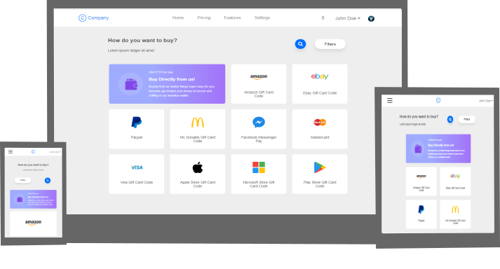

# Dashboard de compras com HTML e CSS responsivo

##### Dashboard responsivo contruído usando apenas HTML e CSS Flexbox Layout

Este é um  projeto utilizando FlexBox Layout do CSS3 na construção de uma página responsiva com um dashboard de compras limpo,agradável, inspirado em um layout que vi anteriormente.

## Tecnologias utilizadas

- HTML5
- CSS FlexBox Layout
- CSS Media Queries
- JavaScript

## Como contribuir?

Fique a vontade para contribuir e notificar sobre bugs ou melhorias para o projeto!

Para isso baixe o projeto para a sua máquina com o git clone e explore-o!

~~~shell
git clone https://github.com/DaniloLima122/dashboard-flexbox.git
~~~

## Licença

- MIT
